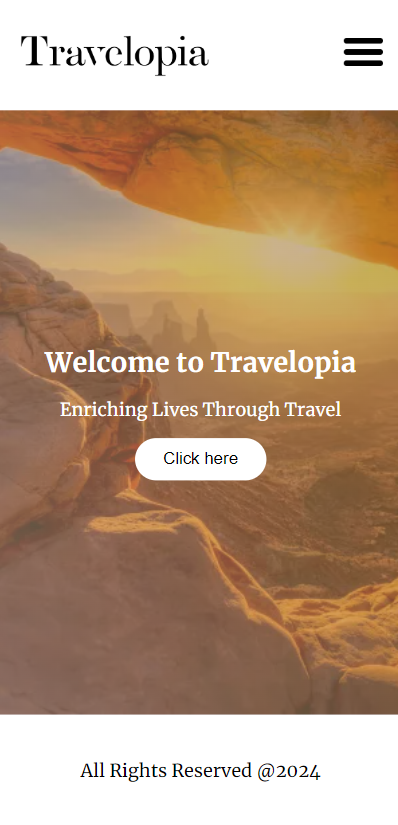
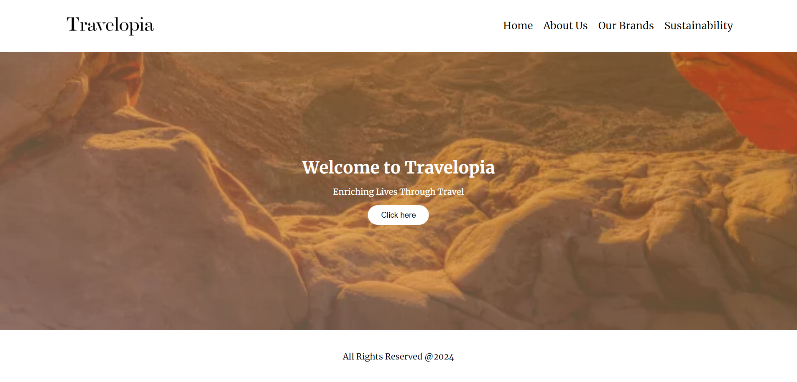
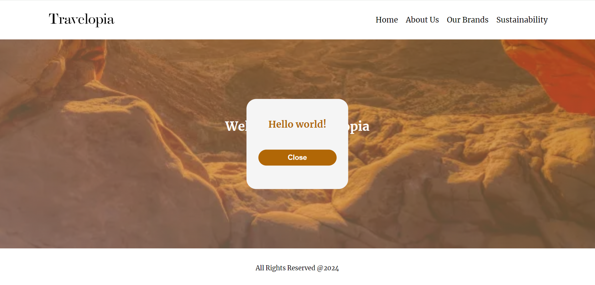

# Travelopia Project

Travelopia is a single-page web application redefining your travel exploration experience. Meticulously crafted with HTML, CSS, and JavaScript, Travelopia offers a sleek and dynamic platform for discovering a world of travel options. Complete with a 100px navbar, 100px footer, captivating imagery with overlay text, and a click-triggered alert button, Travelopia ensures a seamless user experience. With a focus on responsiveness and usability, Travelopia empowers users to embark on their travel adventures with ease. Get ready to explore the world like never before with Travelopia.

### [Deployed Link](https://travelopia-travel.netlify.app/)

### [GitHub Repo Link](https://github.com/artisonii/travelopia-frontend/)

## Features

- Fluid Responsive
- Used **calc()** in css to calculate the hieght the of the mid section
- Header and footer are **100px** and mid section is **calc(100vh - 200px)** which will make the page as fluid responsive and there will be no scrollbar present
- In the navbar I have used humburger icon when the view port width get smaller than **800px** and hide nav inks which were present when the width was more than **800px** which gives us a responsive design for mobile, tablet and web.
- Used **position** property to handle the image present in mid section and also used an overlay and used **overflow-hidden** so it does not let stretch the image

## Tech Stack 
- HTML
- CSS
- JavaScript

## Design Elements 
- **Media Queries** : Media queries are used to create responsive designs that adapt to different screen sizes and device types. By defining specific CSS styles for different viewport sizes, media queries ensure that the layout and content of the webpage are optimized for each device, providing a seamless user experience across desktops, tablets, and smartphones.

- **Overlay** :  An overlay is a translucent layer that is placed on top of another element, typically an image or a section of content. Overlays are commonly used in web design to improve readability and visual hierarchy. I have used linear-gradient as an overlay

- **Responsive Design** :  Adapts page layout using media queries and flex layouts for various devices.

## Screen shots

### **1.** For mobile

### **2.** For desktop

### **3.** For Popup

## Assinment Created by Arti Soni

- [LinkedIn](https://www.linkedin.com/in/arti-soni/)
- [Portfolio](https://artisonii.github.io/)
- [GitHub](https://github.com/artisonii)
